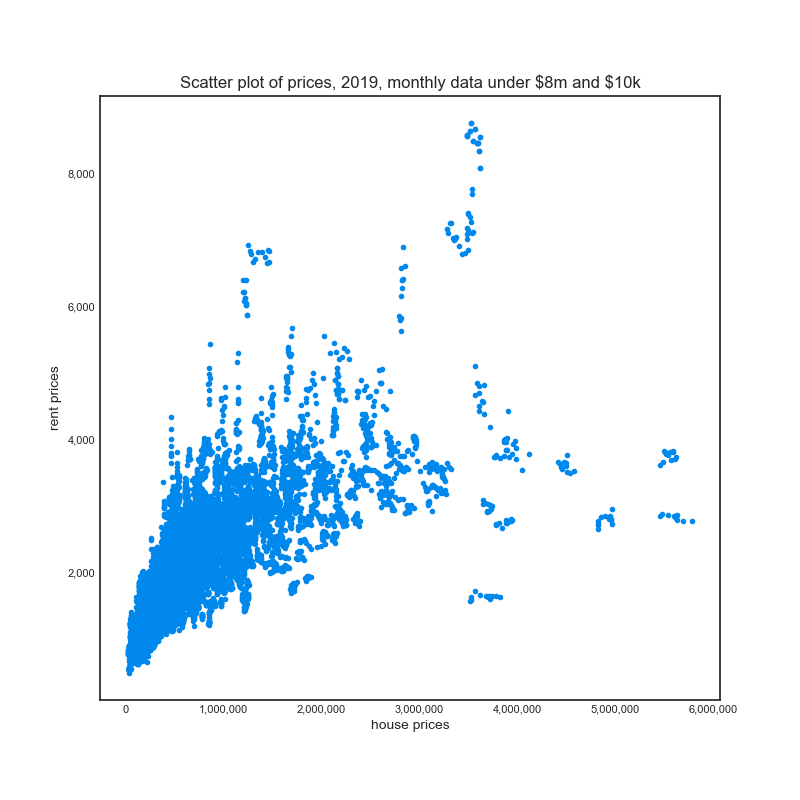
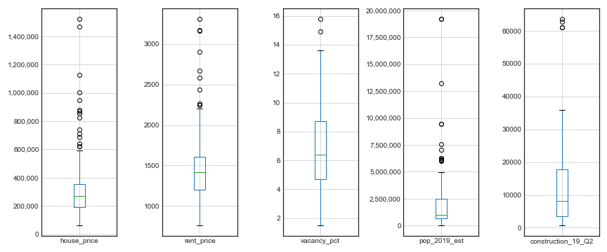
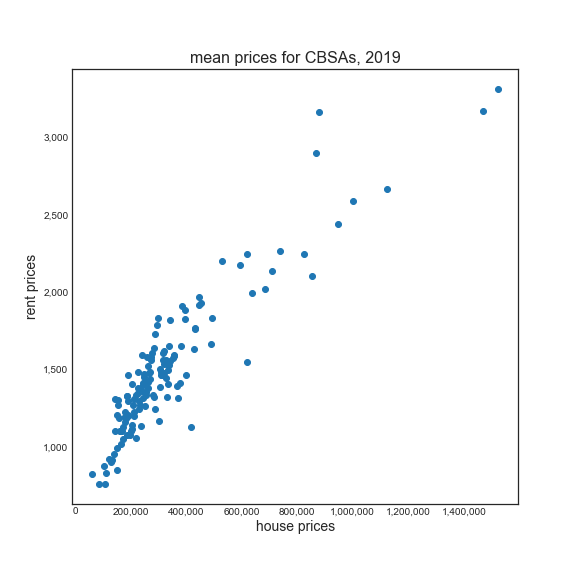
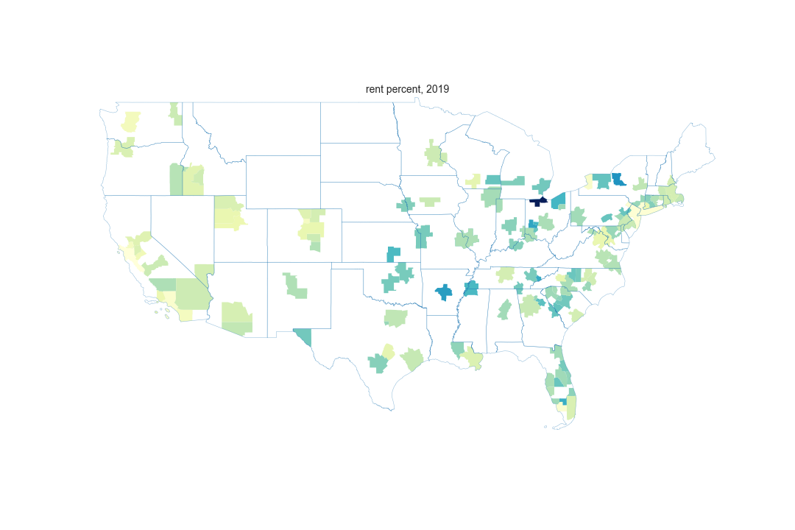
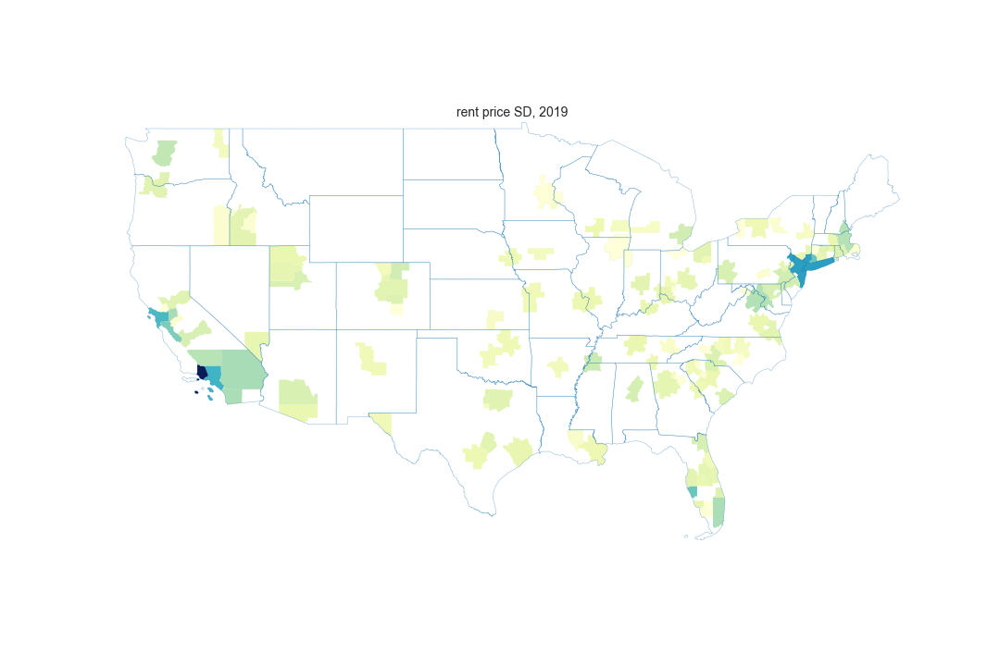
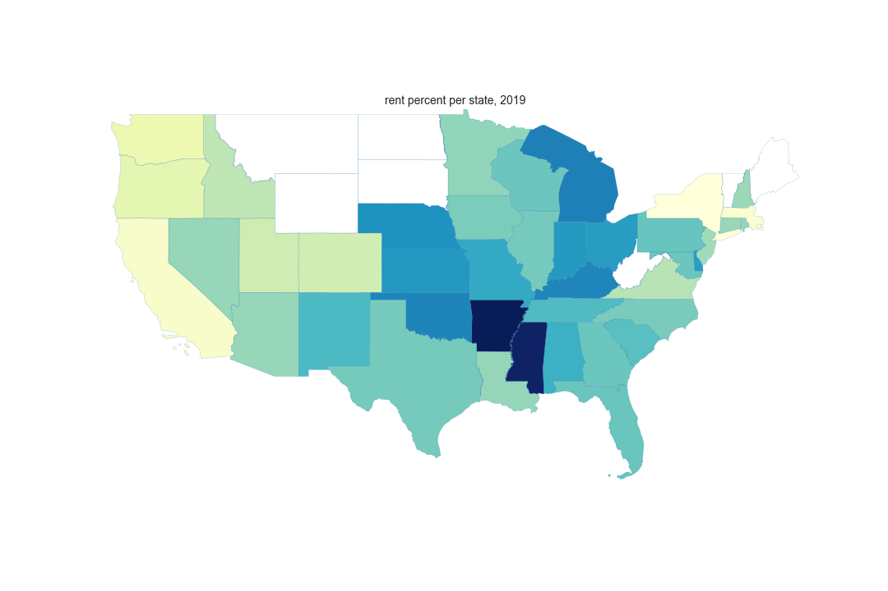

# Realty Market Analyzer

## Overview

This is a project to gather data and develop an analysis of realty markets across the US for the purpose of long term investment properties. There are two major types of investment:

- investment for appreciation
- investment as a rental property

There are many housing price and appreciation prediction tools, but there isn't many (any?) that effectively assess factors to assist with the second type of investment: rental properties.

This project seeks to address that gap.

## Table of Contents

* [Background](#background)
* [Data sources](#data-sources)
* [Core Based Statistical Areas (CBSAs)](#Core-Based-Statistical-Areas-CBSAs)
* [Data cleaning and aggregation](#Data-cleaning-and-aggregation)
* [EDA and visualization](#Exploratory-Data-Analysis)
* [App development](#App-development)
* [Conclusions](#Conclusions)
* [End User and applications](#end-user-and-applications)
* [Future plans](#future-plans)

## Background

The concept of buying property with the intention to rent comes down to some simple math for now.  You need to be able to the pay the mortgage and all expenses with the rental income to enable positive cash flow as well as building equity from day 1.  A common rule is the "1 % rule", [best explained here](https://affordanything.com/one-percent-rule-gross-rent-multiplier/).  In essence, it is similar to a price to earnings ratio in the stock market as a filter - you want the monthly rent to be at least 1% of the purchase price.  This leads to payoff in about 8 years.  

## Data sources

In the current phase of this project, I have integrated the following data:

| Data             | Source | Year or time period available | year or time period focus | rows  | link                                                                                                          | format | key                           | filename                                      |
|------------------|--------|-------------------------------|---------------------------|-------|---------------------------------------------------------------------------------------------------------------|--------|-------------------------------|-----------------------------------------------|
| rent prices      | Zillow | 2014-2020                     | 2019                      | 3234  | https://www.zillow.com/research/data/                                                                         | csv    | zip code                      | Zip_ZORI_AllHomesPlusMultifamily_Smoothed.csv |
| home prices      | Zillow | 1996-2020                     | 2019                      | 30442 | https://www.zillow.com/research/data/                                                                         | csv    | zip code                      | Zip_zhvi_uc_sfr_tier_0.33_0.67_sm_sa_mon.csv  |
| new construction | Census | 2014-2019                     | 2019                      | 384   | https://www.census.gov/construction/bps/msaannual.html                                                        | xls    | CBSA                          | msaannual_201999.xls                          |
| rental vacancy   | Census | 2015-2020                     | 2019                      | 75    | https://www.census.gov/housing/hvs/data/rates.html                                                            | xlsx   | Metropolitan Statistical Area | tab4_msa_15_20_rvr.xlsx                       |
| population       | Census | 2010-2019                     | 2019                      | 81434 | https://www.census.gov/data/tables/time-series/demo/popest/2010s-total-metro-and-micro-statistical-areas.html | csv    | FIPS codes                    | cbsa-est2019-alldata.csv                      |

I also used these files to join the data together:
https://www.census.gov/geographies/reference-files/time-series/demo/metro-micro/delineation-files.html

I used this file to crosswalk the zip codes to the CBSAs:
https://www.huduser.gov/portal/datasets/usps_crosswalk.html

This is the source of the shapefiles for the maps:
https://catalog.data.gov/dataset/tiger-line-shapefile-2019-nation-u-s-current-metropolitan-statistical-area-micropolitan-statist

Data that will be useful for modeling down the road as additional factors:

* Population:
https://www.census.gov/data/developers/data-sets/popest-popproj.html

* BLS unemployment:
https://download.bls.gov/pub/time.series/la/

* Economic indicators:
https://www.census.gov/programs-surveys/susb/data/tables.html

* Additional information on rent prices:
https://www.huduser.gov/portal/datasets/fmr.html

* Crime etc other factors:
https://www.huduser.gov/portal/datasets/socds.html

* Income data?

* Foreclosure data?

## Core Based Statistical Areas (CBSAs)

Throughout this project I refer to this acronym which is statistical area definitions managed by the OMB, and used by Census, HUD, and other Federal agencies.  Collectively these include:

Metropolitan statistical areas have at least one urbanized area of 50,000 or more population, plus adjacent territory that has a high degree of social and economic integration with the core as measured by commuting ties. Micropolitan statistical areas are a new set of statistical areas that have at least one urban cluster of at least 10,000 but less than 50,000 population, plus adjacent territory that has a high degree of social and economic integration with the core as measured by commuting ties. Metropolitan and micropolitan statistical areas are defined in terms of whole counties or county equivalents, including the six New England states. As of June 6, 2003, there are 362 metropolitan statistical areas and 560 micropolitan statistical areas in the United States.

Here is what the CBSAs look like:

## Data cleaning and aggregation

For each of the five data sources, various rearrangements were needed to combine the data into one dataframe.  They are briefly highlighted here and more details are commented in the files.

### Rent and home price data

A description of the rental price data is here: https://www.zillow.com/research/methodology-zori-repeat-rent-27092/, briefly it is a repeat-rent index that is weighted to the rental housing stock to ensure representativeness across the entire market, not just those homes currently listed for-rent. The index is dollar-denominated by computing the mean of listed rents that fall into the 40th to 60th percentile range for all homes and apartments in a given region, which is once again weighted to reflect the rental housing stock.
I utilized the data by zip code, which is reported monthly, but not all zip codes and not every month.  In fact, some states did not have any rent data, these include: 'AK', 'ME', 'MT', 'ND', 'SD', 'VT', 'WV', 'WY'.  

A description of the home price data is here: https://www.zillow.com/research/zhvi-methodology-2019-highlights-26221/
I utilized the single family home median data by zip code.  Ideally I would pull more data and try to focus on the types of properties that would become rental units, possibly filtering by bedroom size etc.

I merged this together by month and took the means for 2019, in only a couple cases did I not have any rent price data for 2019.
I used the zip code to CBSA to associate a CBSA with each zip code and took the means for each CBSA, noting the SD which in some cases was high between zip codes, or in some CBSAs which included over 1,000 zip codes.  See under Population data for reasons for aggregating.

### Construction data

New privately-owned residential construction - A monthly survey of 9,000 selected permit-issuing places; and an annual census of an additional 11,000 permit places that are not in the monthly sample. The monthly sample of permit-issuing places was selected using a stratified systematic sample procedure. All permit places located in selected large metropolitan areas were selected with certainty. The remaining places were stratified by state.  New construction could influence the supply and demand of residential properties and could be a leading indicator for changes in an area. For the most part this was straightforward and had CBSA information, though only for the top 75 areas.

### Rental vacancy data

Like new construction, vacancy rates could indicate trends and also the ability to rent the property consistently.  An overview of this data is provided [here](https://www.census.gov/housing/hvs/methodology/index.html), essentially a using a probability selected sample of about 72,000 housing units, both occupied and vacant in a 4-8-4 month sampling scheme.  Sadly all of the files available in this area are poorly formatted excel files with outdated MSA region names but no CBSA codes.  I utilized the March 2020 "Principal cities of metropolitan and micropolitan statistical areas" file ("list2_2020.xls") from [here](https://www.census.gov/geographies/reference-files/time-series/demo/metro-micro/delineation-files.html) to resolve this and associate with current CBSA codes.

### Population data

Each year, the United States Census Bureau produces and publishes estimates of the population for the
nation, states, counties, state/county equivalents, and Puerto Rico.1 We estimate the resident population for each year since the most recent decennial census by using measures of population change. The resident
population includes all people currently residing in the United States. Population information could be used to control for variation or could indicate trends that would influence housing availability.  While I had zip code specific price information, it would be difficult to include population data since Census doesn't use zip codes, and even though they have [zip code tabulation areas](https://www.census.gov/programs-surveys/geography/guidance/geo-areas/zctas.html), these don't list all zip codes in each area.  In addition, for the purposes of mapping, it would be easier to map CBSAs rather than zip codes.

## Exploratory Data Analysis

I chose to aggregate the data for reasons discussed above.  As I aggregated, I looked the variation in the data for the key variables in which I had the most data: rent and home prices.  Here, box plots highlight some potential outliers:

In the initial data before aggregating, the high rent and high home prices come from just a couple areas:
high rents (above $10k) were in 6 towns on Long Island: 'Bridgehampton' 'Water Mill' 'Hampton Bays' 'Sag Harbor' 'East Hampton' 'Southampton', and high home prices (above $6m) were in three zip codes in NYC: 10075 10065 10021.

After removing these points (because no one is going to invest in these places!), the data is easier to see:

Just to validate, I looked to see if I could rent in these places:

As discussed above, my plan was to aggregate further by CBSAs, and as I did that, I tracked SD and the number of zip codes in each CBSA - some had large variation:

| CBSA_name                                    |   zip_codes_num |   min_house_price |   max_house_price |   min_rent_price |   max_rent_price |
|:---------------------------------------------|----------------:|------------------:|------------------:|-----------------:|-----------------:|
| Los Angeles-Long Beach-Anaheim, CA           |             219 |        257,736.25 |      3,659,961.00 |         1,449.08 |         8,506.18 |
| New York-Newark-Jersey City, NY-NJ-PA        |             215 |        178,553.33 |      5,608,781.83 |         1,287.25 |         7,014.58 |
| Miami-Fort Lauderdale-Pompano Beach, FL      |             142 |        169,412.08 |      2,467,936.17 |         1,200.33 |         4,264.08 |
| Chicago-Naperville-Elgin, IL-IN-WI           |             139 |         51,841.91 |      1,200,853.58 |           852.00 |         3,152.73 |
| Washington-Arlington-Alexandria, DC-VA-MD-WV |             125 |        205,120.67 |      1,510,548.17 |         1,242.27 |         4,068.90 |

After aggregating the means and SD over 12 months of 2019, the variables looked like:

Once I had the data in one aggregated dataframe, I was able to look at relationships between the data.  Here is a scatterplot of the relationship between the prices for the means of CBSA:

Since I only had construction and vacancy data on a subset, I am keeping that data but didn't include much analysis - I think it will be more useful down the road as potential features to integrate into models.

I calculated the rent to price percent, as mentioned in the background this would be a key factor in investment decisions.  It does take into account potential expenses such as property tax etc.

|   zip_code | CBSA_name                                   |   house_price |   rent_price |   rent_pct |
|-----------:|:--------------------------------------------|--------------:|-------------:|-----------:|
|      48205 | Detroit-Warren-Dearborn, MI                 |     24,989.58 |       800.83 |       3.20 |
|      21223 | Baltimore-Columbia-Towson, MD               |     43,384.25 |     1,226.58 |       2.83 |
|      48228 | Detroit-Warren-Dearborn, MI                 |     31,398.67 |       883.17 |       2.81 |
|      60636 | Chicago-Naperville-Elgin, IL-IN-WI          |     53,081.08 |     1,298.33 |       2.45 |
|      48227 | Detroit-Warren-Dearborn, MI                 |     33,044.58 |       796.50 |       2.41 |
|      44105 | Cleveland-Elyria, OH                        |     33,844.50 |       783.25 |       2.31 |
|      19132 | Philadelphia-Camden-Wilmington, PA-NJ-DE-MD |     45,085.33 |     1,034.92 |       2.30 |
|      63136 | St. Louis, MO-IL                            |     39,071.92 |       854.42 |       2.19 |
|      48224 | Detroit-Warren-Dearborn, MI                 |     37,301.75 |       806.83 |       2.16 |
|      60621 | Chicago-Naperville-Elgin, IL-IN-WI          |     51,841.91 |     1,085.09 |       2.09 |

Here is the top five CBSAs by rent percent:

| CBSA_name                                |   zip_codes |   house_price |   rent_price |   rent_pct |
|:-----------------------------------------|------------:|--------------:|-------------:|-----------:|
| Toledo, OH                               |          12 |     62,290.67 |       822.25 |       1.32 |
| Syracuse, NY                             |          11 |    145,406.91 |     1,306.82 |       0.90 |
| Little Rock-North Little Rock-Conway, AR |          47 |     88,210.00 |       758.45 |       0.86 |
| Memphis, TN-MS-AR                        |          36 |    154,579.97 |     1,300.36 |       0.84 |
| Dayton-Kettering, OH                     |          98 |    105,751.48 |       878.26 |       0.83 |

I also aggregated by state, and include counts of CBSAs in each state, and also to demonstrate two important aspects of this data:

* States with no data

* variation in the data among states

In order to aggregate this data, I needed to understand Census boundary classifications of which there are many.  In the end, I settled on using CBSAs because they were higher resolution than states, but available to map more easily than zip codes.  While there are around 930 CBSAs, my data only included 140 of them, mostly due the lack of rent data.

In the end this data lends itself to a predictive type of approach and it appeared there were large differences in the data within CBSAs.  However I still wanted to see the relationship between the rent percent I calculated, and the variables I have been using.  To do this, I performed correlation analysis using Spearman's and discovered that it is negatively correlated with population and new construction, but positively correlated with vacancy.  Keep in mind that I only have construction and vacancy data on a smaller subset of CBSAs.

* rho with vacancy: 0.29
* rho with construction: -0.36
* rho with population: -0.29

For the predictive analysis, that will be performed down the road.

## App development

Ideally this project will develop an app that will enable users to explore the data and filter based on their preferences.  Towards that end, the draft rent percent data was loaded into a map using Flask, Folium, and Heroku to deploy a browser based map, which is currently hosted here: https://realty-markets.herokuapp.com/.  Unfortunately because the map data is 50MB, it takes a while to load and I need to work further on optimizing it.  Here is what that app looks like:

## Conclusions

In conclusion, I found:

* Large variation across zip codes and CBSAs for investible characteristics in rental properties
* Some potentially interesting zip codes that can be further investigated

## End User and applications

The intended end users and market will be those looking to invest in realty with data supported decision making tools.  Ideally this will be in a subscription website or app format.

## Future plans

* calculate payoff data for each zip code
* pull data from more years and analyze time series
* integrate more data sources mentioned above
* consider scraping or obtaining additional sources of rental price data
* convert to a SQL database using APIs to pull and organize data
* test parameters like income to estimate others
* use bayesian techniques to estimate rent and price for areas in which we don't have data yet
* further develop app with time series slider and ability to map zip codes and standard deviation in data

## Code details

The main files use for this analysis are:

* classes and functions are in src/classes.py and src/functions.py
* initial exploration is in notebooks/EDA.ipynb
* aggregation and plotting is in notebooks/aggregation.ipynb